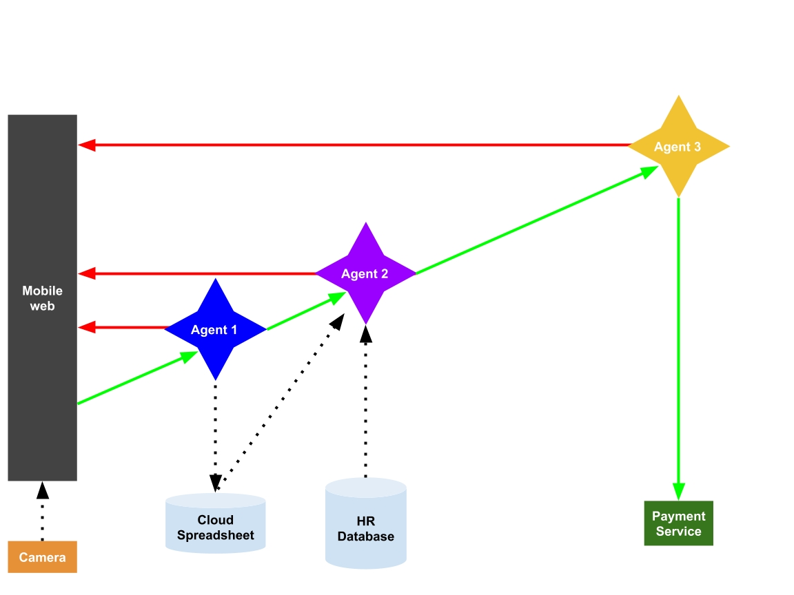

# Instructions

## Before you begin

Make a copy of the Project Template in [Google Docs](https://docs.google.com/document/d/15hbJd-8FUh5iP5_2Y2YhDM-DDZaZsBwzFy4fepbyMSo/copy) or [Microsoft Word format](https://video.udacity-data.com/topher/2025/July/686efb96_project-template_-agentic-expense-reporting-system/project-template_-agentic-expense-reporting-system.docx). As you complete each activity, write your responses in the doc.

## Step 1: Review the current system documentation

Analyze the diagram and written steps below to familiarize yourself with the system's components, data, and logic.

### Components

- Mobile web UI
- Mobile camera
- Agent 1 for data extraction
- Agent 2 for computation and comparison
- Agent 3 for decision-making
- Third-party payment service

### Data

- Database of reference images of allowable receipts
- Third-party cloud-based spreadsheet for policy guidance and data capture

### System Flow

1. On a mobile web browser, an employee fills out an expense report form and uploads photos of the receipts
2. Agent 1
  a. Extracts transaction data from the receipt images
  b. Saves the data to the appropriate fields in a cloud-hosted spreadsheet’s `data` tab
3. Agent 2
  a. Computes the total of all the receipts
  b. Analyzes the expenses with respect to the policies defined in the spreadsheet's 'policy' tab
  c. Summarizes the expense report and includes a recommendation to 'approve' or 'reject', with an explanation
4. Agent 3
  a. Reviews Agent 2's analysis
  b. Considers the employee's role in the company and the purpose of the expenses
  c. Approves or rejects the payment
    i. If rejected, send the user an error message with an explanation
    ii. If approved, use a payment tool to reimburse the employee.

---

  

---

## Step 2: Find and fix a bug

In certain cases, the system is saving hallucinated data to the database. If not fixed, your company will lose a lot of money on overpaid expense reports, and face many angry employees with underpaid reimbursement requests.

Do the following:

- Identify the location of the bug
- Describe how the system should be working and what it is doing incorrectly
- Explain how to fix it

## Step 3: Add human review

Before approving payment of an expense >$500, the system should consult a human team member for approval.

Describe how and where in the system to add this capability.

## Step 4: Ensure customer privacy

Your company currently hosts all data on servers located in the United States. With the opening of an office in the European Union, you must now comply with local data privacy regulations.

Do the following:

- Identify the parts of the system that are vulnerable
- Describe how to protect any Personally Identifiable Information (PII) used by the system

## Step 5: Extend the workflow

Your product is very popular and customers have requested the following new capabilities.

- Pay via Bitcoin
- Export an employee’s transaction history to a spreadsheet
- Enable an employee to recategorize a past expenditure
- Enable expense itemization so one person can pay for a group outing with a single expense report
- In special situations, require approval by two people in two different departments

Pick one and describe how to extend the system to implement it.

## Step 6: Estimate operational cost drivers

Analyze the initial system architecture and identify the activities where:

- Costs are expected to be flat and low regardless of volume
- Costs are expected to be flat and high regardless of volume
- Costs are expected to be highly variable depending on volume, and could become expensive
